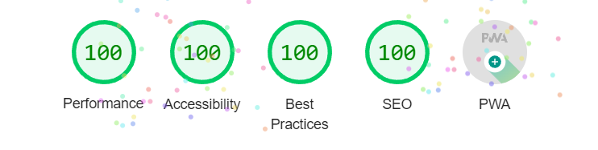
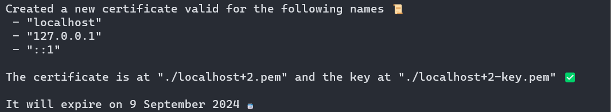
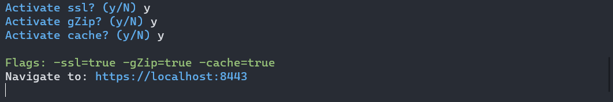
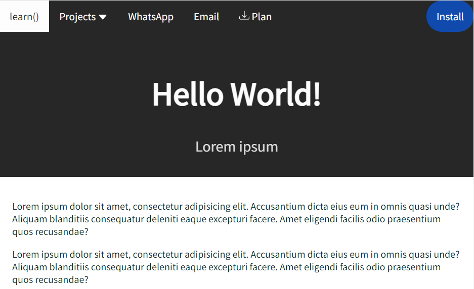

### 🌐 pwasimple



PWA template that includes:
- SSL generation for localhost
- Server for localhost
- SASS with normalization and some example variables
- PWA files
- Useful files for SEO and server
- 100% Lighthouse

### Requirement before utilization

- [node](https://nodejs.org/en/)
- [SASS](https://sass-lang.com/). It's not required, but it's good to have.
- [Git](https://git-scm.com/)

### 💻 How to use

1. **Clone and rename**

```shell
git clone https://github.com/andrei-nita/pwasimple.git myProject
```

`myProjecgt` is the project name

2. **Copy mkcert and staticserver**

```shell
cd myProject
```

- For Windows:

```shell
cp .\_localhost\mkcert\mkcert-windows-amd64.exe .
cp .\_localhost\staticserver\staticserver-windows-amd64.exe
```

- For Linux

```shell
cp .\_localhost\mkcert\mkcert-linux-amd64.exe .
cp .\_localhost\staticserver\linux-windows-amd64.exe
```

- For Mac M Chip

```shell
cp .\_localhost\mkcert\mkcert-darwin-arm64.exe .
cp .\_localhost\staticserver\linux-darwin-arm64.exe
```

- For Mac With Intel

```shell
cp .\_localhost\mkcert\mkcert-darwin-amd64.exe .
cp .\_localhost\staticserver\linux-darwin-amd64.exe
```

> For the other steps I assume you are on a Windows OS. If you are using other OS, use the corresponding executable from above.

3. **Install SSL for localhost**

- Certificate Authority

```shell
.\mkcert-windows-amd64.exe -install
```

> The command above, installs a **CA** in the **system trust store**.

> Run the command above, **_only once; other projects you clone don't require this step_**.

- Create certificates

```shell
.\mkcert-windows-amd64.exe localhost 127.0.0.1 ::1
```



The command above creates two files: `localhost+2.pem` and `localhost+2-key.pem`.


4. **Start the server**

```shell
.\staticserver-windows-amd64.exe
```

Respond to `y` to all the questions, like in the example below.



The server uses port `:8080` for `http` and `:8443` for `https`

5. **Open the website**

Click on the terminal or open in the browser: [https://localhost:8443](https://localhost:8443)



6. **Modify index**

Inside `index.html` change `Hello World!` text.

> Reset browser with `F5` might be required if changes are made to PWA files.

7. **Live reload**

- Use an IDE like Jetbrains
- Or use a tool like [browser-sync](https://browsersync.io/docs/command-line)

8. **PWA utilities**

- [Generate images](https://www.pwabuilder.com/imageGenerator). This tool was use to generate `img/AppImages` and the `tile.png` was used.

### 🙏🏻 Thanks to

- [SASS](https://sass-lang.com/)
- [HTML5 boilerplate](https://html5boilerplate.com/)
- [W3CSS](https://www.w3schools.com/w3css/w3css_downloads.asp)
- [mkcert](https://github.com/FiloSottile/mkcert)